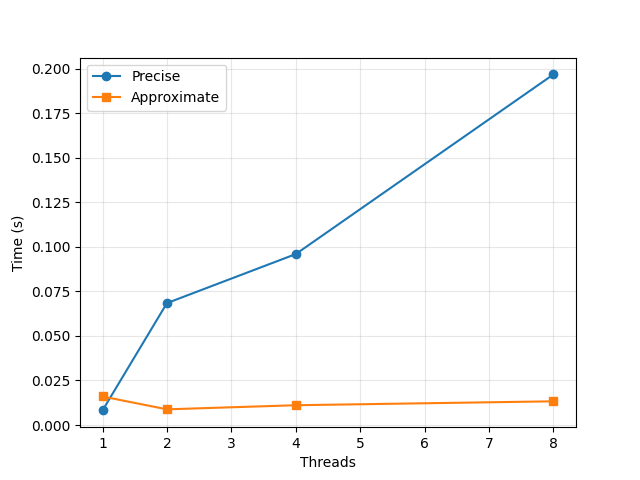

# Concurrent Counter: Precise vs. Approximate

Implementation and benchmarking of two concurrent counter designs from OSTEP Chapter 29.

**Goal:** count at scale across multiple threads.

## Results



10-core MacBook Air. 1M increments per thread. Precise scales linearly (no parallelism). Approximate stays nearly flat (near perfect scaling). Below n=2 the precise counter is faster; beyond that, the approximate counter wins by a growing margin.

## Approach 1: Precise Counter (`lock_counter.c`)

A single `pthread_mutex_t` around a shared integer. Every increment acquires the lock, updates `value`, releases.

**Correct, but doesn't scale.** Two reasons:
- The lock serializes all updates which means that N threads do the same work as 1 thread, sequentially.
- The cache line holding `value` ping-pongs between cores on every increment, costing ~50–100ns per bounce.

Total time grows roughly linearly with thread count.

## Approach 2: Approximate Counter (`approx_counter.c`)

One local counter per CPU plus one global counter. Threads update their local counter on the fast path (cheap, no shared state). When a local counter hits a threshold S, its value is transferred to the global counter under the global lock and the local is reset.

**Why it scales:** the global lock (aka the contention point) is updated once every S increments instead of every single one. Local locks live on different cache lines, so cores don't fight over them.

**Tradeoff:** `get()` returns the global value, which lags the true count by up to `NUM_CPUS × (S - 1)` increments still sitting in locals. Hence "approximate."

## The False Sharing Bug

The textbook implementation was actually **slower** than the precise counter. Cause: `int local_values[NUM_CPUS]` is 40 bytes total and all 10 ints fit in one 128-byte cache line. Even though threads wrote to different array indices, the hardware saw cores writing to the same cache line and shuttled it back and forth on every increment. False sharing.

**Fix:** pad each local counter to its own cache line.

I looked this issue up and the problem is called false sharing. 

Padding pushes each counter onto its own cache line, so cores writing to different counters are now truly writing to different cache lines, with no coherence traffic between them.


```c
typedef struct {
    int value;
    char pad[CACHE_LINE - sizeof(int)];
} padded_int_t;
```

Same treatment for the local locks. After padding, each per-CPU slot lives on its own cache line, no coherence traffic between cores. This is what made the approximate curve flatten.

## Files

- `lock_counter.c`  precise counter implementation and benchmark
- `approx_counter.c`  approximate counter with cache-line padding
- `benchmark.py`  runs both binaries across thread counts, plots results
- `benchmark.png`  output plot

## Build & Run

```bash
gcc -O2 -Wall -Wextra -pthread lock_counter.c -o lock_counter
gcc -O2 -Wall -Wextra -pthread approx_counter.c -o approx_counter
python3 benchmark.py
```

Each binary takes one argument: number of threads.

```bash
./lock_counter 4
./approx_counter 4
```

## Tunable Parameters

In `approx_counter.c`:
- `NUM_CPUS` match your machine's core count (`sysctl -n hw.ncpu`)
- `THRESHOLD` local-to-global sync frequency. Higher = better scaling, less accurate `get()`.
- `CACHE_LINE`  128 on Apple Silicon, 64 on most x86

## Key Takeaways

1. A single lock is correct but doesn't scale: serialization plus cache-line bouncing.
2. Per-CPU partitioning enables real parallel scaling, but only if the data layout cooperates.
3. False sharing silently kills parallelism even when the source code looks like it doesn't have any contention issues. The fix is layout (padding), not logic.
4. More concurrency isn't always faster — at low thread counts, the simpler design wins. Concurrent designs only pay off when there's real contention to avoid.